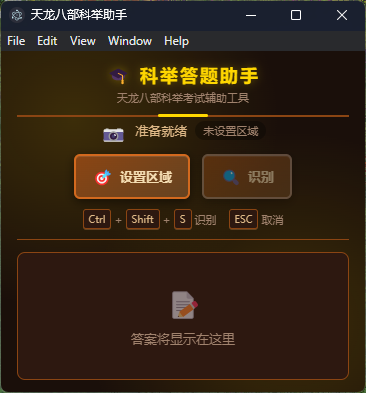

# 天龙八部科举答题助手 🎓

一个基于 Electron 的桌面应用，通过 OCR 识别屏幕上的题目文字，自动匹配本地题库并显示答案。



## ✨ 功能特性

- 🎯 **区域框选**：通过鼠标拖拽框选屏幕上的题目区域
- 🔍 **OCR 识别**：使用 Tesseract.js 识别中文文字
- 📚 **智能匹配**：支持精确匹配、模糊匹配和关键词匹配
- 💡 **答案显示**：识别完成后自动弹出答案窗口

## 🚀 快速开始

### 环境要求

- Node.js 16+
- yarn

### 安装依赖

```bash
yarn
```

### 开发模式运行

```bash
yarn start
```

### 打包 Windows 应用

```bash
yarn build:win
```

## 📖 使用说明

1. 启动应用后，点击「设置识别区域」按钮
2. 屏幕会出现半透明遮罩，用鼠标拖拽框选题目区域
3. 设置完成后，点击「开始识别」按钮进行识别
4. 应用会自动识别文字并匹配答案，答案显示在窗口中
5. 按 `ESC` 可以取消区域选择

## 📚 题库配置

题库文件位于 `questions/questions.json`，格式如下：

```json
[
  {
    "question": "题目内容",
    "answer": "答案内容"
  }
]
```

你可以根据需要添加更多题目到题库中。

## 🛠️ 技术栈

- **Electron** - 跨平台桌面应用框架
- **Tesseract.js** - JavaScript OCR 引擎
- **Fuse.js** - 模糊搜索库
- **Sharp** - 图像处理库
- **screenshot-desktop** - 屏幕截图

## 📁 项目结构

```
tlbb_imperial_examination/
├── src/
│   ├── main/           # 主进程
│   │   └── main.js     # 主进程入口
│   ├── preload/        # 预加载脚本
│   │   └── preload.js  # IPC 通信桥接
│   └── renderer/       # 渲染进程
│       ├── index.html  # 主窗口
│       ├── selection.html  # 区域选择窗口
│       ├── answer.html # 答案显示窗口
│       ├── styles.css  # 样式文件
│       └── renderer.js # 渲染进程脚本
├── questions/          # 题库目录
│   └── questions.json  # 题库数据
├── assets/             # 资源文件
├── package.json        # 项目配置
└── README.md           # 说明文档
```

## ⚠️ 注意事项

1. 首次启动时 OCR 引擎需要下载语言包，请确保网络畅通
2. 识别准确率受图像清晰度和字体影响
3. 建议在高清显示器上使用以获得更好的识别效果
4. 题库需要提前配置好才能匹配答案

## 📄 许可证

MIT License

